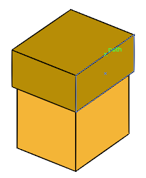

#		Adobe Illustrator Tutorials

##		Selection Tool
1.	Pt and Pixels are same no issues
2.	All the tools in the pallet have their menu and contains other tools
3.	Artboard is the option which will create no of pages in the artboard
4.	When we only press the rectangle tool on the artboard it will option for sizes
5.	When we use shift key while drawing rectangle it will draw sqare always
6.	Using Spacebar you can move the artboard
7.	Using alt key and move a object it will copy it 
8.	Using ctrl+SPACE to use zoom tool
9.	Using v key to move to the selection tool
10.	When we use alt key it always reverse the operation function like zoom in to zoom out
11.	In any tool when we press spacebar we can move the whole artboard
12.	The resize handle in the object end points are used to change the size of the object 
13.	If I use shift key then it will change size in the same proportion (Equal width and equal height ratio)
14.	Near to the resize hadle there is a rotation handle appears to rotate the object
15.	Using shift key will rotate the object in 45^ each rotation
16.	Using ctrl+D we can repeat the previous operation done by selection tool.
17.	When taking copy using alt key we can press shift key to take 90* copies
18.	Experiment You can Create multiple copies using ctrl+D after copying previous one we can create a list of object in sequence like in the Bee.ai file
19.	Using shift key we can create straight object creation.
20.	When using array of similar objects we can select particular individual or group object using shift key similar like using shift key to select folders in explorer
21.	Illustrator provides 6400 % zoom
22. There are two things in the color pannel so we have two things Fill and Stroke As such the Fill represents the color inside the object and Stroke represent the boundary color of the object.
23. You can simple copy an object by dragging via pressing the alt key during drag.
24. Since that use ctrl + d to repeat the drag and you can do the same task with same distance.

##		Direct Selection Tool

1.	This tool is similar like the selection tool and basically used to create vector graphics
2.	Line segment is called as the end points of the line 
3.	The end point it called as anchor point
4.	The line which have no fill and stroke is called as path
5.	The main purpose of this tool is to we can change position of individual points 
6.	We can group multiple in a object by using ctrl+G
7.	Handles in the illustrator every object have its handles for changeing its shape.
8. Illustrator is more over geometry of school.
9. The blue dot at the end of a point is called as anchor point.
10. The inner circles near sides which act as curves can be used to give curves to the shape like changing a square to 1/4 th part of circle.
11. When you select a particular side of rectangle with direct selection tool you can change the inner circle properties of single side or selected side of the shape.
12. Handles and anchor points are same we can use them to bend the shape of the object.
### Create Cuboid Container
 
1. Draw a Rectangle or Square make 3 copies of it, one on top and one on right intersecting to the 1st block.
2. Select the top handles of the top square and bend them towards bottom right.
3. Similarly select the right handles of the right square and bend them towards top left.
4. As such we have a cuboid now, select from left to rotate the cuboid like this.
5. Select Left handles of bottom and top square and bend towards top for rotating the cuboid.
6. Now make copy of the shape and risize it with slection tool.
7. Now Select from the bottom of the main and right square and resize the path to reduce its height.
8. Now you have prepared both the box and its cap now use selection tool to select objects and drag on top of the 1st cuboid.

